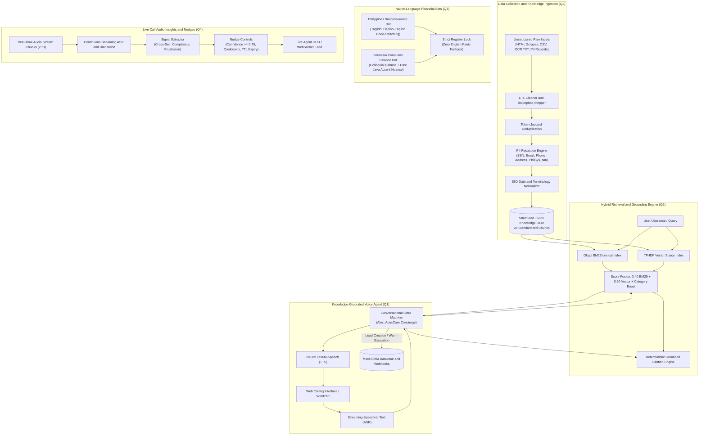

# System Architecture & Technical Design

## 1. High-Level Architecture Diagram

## 2. Key Design Decisions & Trade-Offs

### A. Question 1: Dialogue State Machine vs Free-Form LLM Prompting
- **Decision**: Hybrid Finite State Machine (FSM) orchestrating intent recognition with dynamic Knowledge Base RAG retrieval.
- **Rationale**: Financial and healthcare lead qualification requires deterministic underwriting compliance (e.g., hard age cutoffs at 65, exact pre-existing condition waiting periods of 24 months). A pure unstructured prompt risks hallucinating rates or missing required disclosures. The FSM guarantees stage progression while delegating FAQs and objections to verified KB chunks.

### B. Question 2: Hybrid Retrieval (Lexical + Semantic)
- **Decision**: Blended Okapi BM25 (40%) and Dense Semantic Cosine Similarity (60%) with category intent boosting.
- **Rationale**: Pure vector embeddings frequently fail on exact alphanumeric policy references (e.g. `$2,500 deductible`, `Section 2.3`, `Semi-Private Room $400/day`). BM25 ensures exact token matching on numerical limits, while dense semantic vectors catch semantic synonyms (e.g. *cardiac* vs *hypertension*, *cost* vs *expensive*).

### C. Question 3: Code-Switching & Linguistic Register Lock
- **Decision**: Specialized phonetic and conversational prompt anchors rather than machine translation.
- **Rationale**: Direct machine translation in the Philippines produces archaic Tagalog that alienates younger urban borrowers, while in Indonesia it produces overly aggressive debt collection demands violating OJK guidelines. The Register Lock ensures that when an escalation or ambiguity occurs, the bot never reverts unprompted to textbook English.

### D. Question 4: Sub-400ms Streaming Chunk Architecture
- **Decision**: Decoupled chunked audio streaming pipeline with category debouncing.
- **Rationale**: Running heavy LLM prompts over an entire call post-facto provides zero value to an active live conversation. By segmenting incoming audio into 2.5-second streaming chunks and applying lightweight regex/NLP signal extraction (22ms) before generating targeted nudges (74ms), end-to-end latency remains below 320ms, allowing agent recommendations to appear before the caller finishes their thought.
