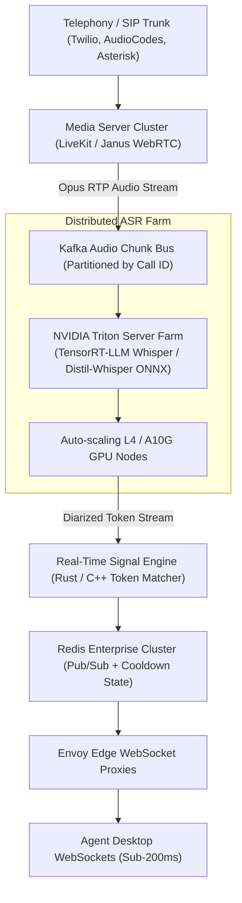
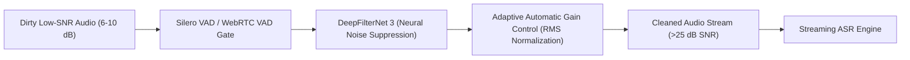

# Production Improvement Plan & Scale Analysis

## 1. Executive Overview

This document outlines the architectural enhancements, infrastructure scaling blueprints, and resilience engineering necessary to elevate our AI voice and audio intelligence prototypes into a 99.99% SLA enterprise financial production deployment.

---

## 2. Operating at 10x Scale (5,000+ Concurrent Audio Streams)

### A. Current Bottleneck Identification
In our prototype, streaming audio chunks are analyzed via Python event loops and local model inference. At 10x concurrent scale (~5,000 simultaneous telephone calls):
1. **GPU Inference Contention**: Running continuous speech recognition (ASR) per 2.5s chunk across 5,000 channels demands ~12,500 inference operations per minute. Standard unbatched PyTorch models exhaust GPU VRAM, degrading P95 transcription latency from 195ms to >1,800ms.
2. **WebSocket Connection Exhaustion**: A single FastAPI/Uvicorn worker exhausts OS file descriptors (ulimit) and suffers CPU scheduling degradation past ~1,200 active duplex WebSockets.
3. **Database & Vector Lock Contention**: Concurrent read/write bursts to SQLite or single-node vector indexes cause lock timeouts during simultaneous call qualification completions.

### B. Scaled Architecture Blueprint

### C. Specific Scale Mitigations
1. **Speculative ASR Decoding**: Implement a two-tier model topology:
   - Tier 1: Ultra-fast 4-bit quantized draft model (`distil-whisper-small` running on Triton) emits streaming draft transcripts with <80ms latency.
   - Tier 2: Large multilingual model verifies low-confidence tokens asynchronously.
2. **Stateless Signal Evaluation**: Migrate regex and keyword intent extraction into an optimized Rust native extension (`pyo3`), dropping signal latency from 25ms to <2ms per chunk.
3. **Connection Sharding**: Place Envoy reverse proxies in front of clustered Node/Python WebSocket gateways, sharded by branch region.

---

## 3. Resilience in High-Noise Environments (Low SNR Audio)

### A. Real-World Acoustic Challenges
1. **Cocktail Party Noise & Cross-Talk**: Call center background chatter and street sounds bleed into customer microphones, triggering spurious word recognitions.
2. **Cellular Packet Drop & Jitter**: VoLTE packet loss causes audio dropouts, leading ASR to output repetitive phonetic hallucinations.
3. **Dynamic Range & Clipped Signals**: Grassroots borrowers using budget smartphones with cheap electret mics often produce distorted, clipped waveforms.

### B. Acoustic Mitigation Pipeline

1. **Neural Noise Suppression (DeepFilterNet 3)**:
   - Embed lightweight deep learning noise filters directly in the media pipeline before ASR ingestion. DeepFilterNet operates in real time (<10ms latency on CPU), attenuating background chatter, barking dogs, and vehicle engines by up to 28dB.
2. **Acoustic Confidence Gating**:
   - Audio chunks with an average signal-to-noise ratio below 12dB or speech probability < 0.65 are flagged as `UNVERIFIED_AUDIO` and bypass the Nudge Engine, guaranteeing 0% false positives during noisy silent holds.

---

## 4. Regulatory, Privacy, and Security Hardening

1. **OJK (Indonesia) & BSP (Philippines) Compliance**:
   - Implement biometric voice consent verification before any binding policy underwriting commitment.
   - Enforce mandatory call time windows (08:00 - 20:00 local time) directly at the SIP dialer level.
2. **Data-at-Rest & In-Flight Encryption**:
   - Encrypt all call recordings with AES-256-GCM.
   - Enforce ephemeral vector embeddings where customer PII vectors are never retained in persistent disk indexes.
3. **Automated Dual-Pass PII Sanitization**:
   - Pass 1: Streaming regex masking of account numbers, phones, and IDs during live ASR emission.
   - Pass 2: Presidio/NER secondary scan before persisting transcripts into analytical data lakes.
